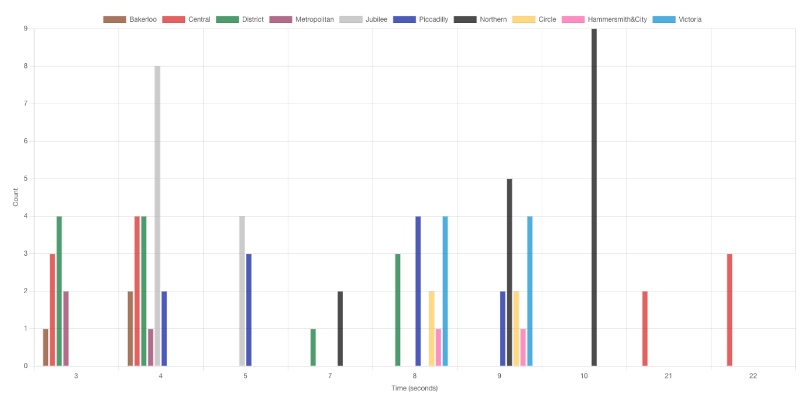
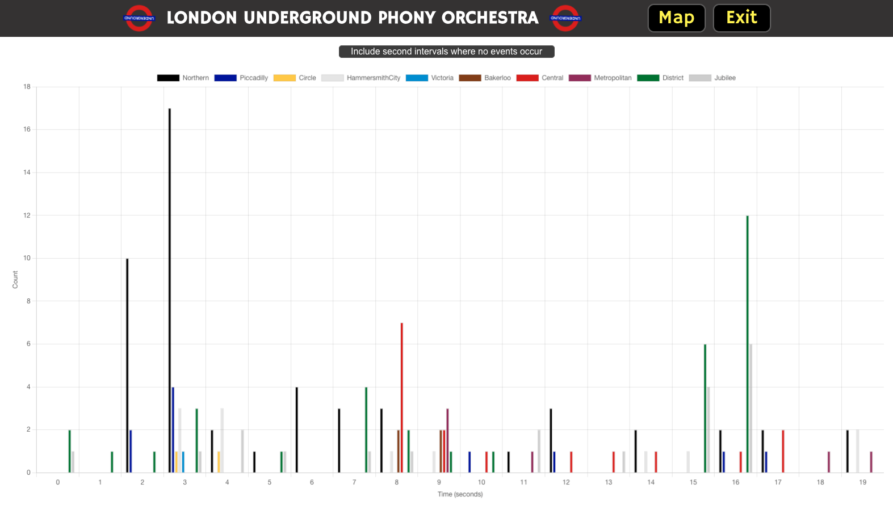

# TfL Data Visualiser App

This project is an offshoot of the [lupo](https://github.com/pablisch/lupo) (name correct at time of writing) repository for the London Underground Phony Orchestra App made as a final project of the Makers Software Dev Bootcamp.

## Installing the app

1. Clone this repository to your local machine
2. cd into the repository
3. `npm install` to install dependencies

## Running this app

To run this app in development mode:
```bash
npm start
```

To run this app in production mode:
Requires [serve](https://www.npmjs.com/package/serve) to be installed globally
```bash
npm install -g serve
```
Then run:
```bash
npm run build
serve -s build
```

## Project Goals

The goal of this project is to create a data visualisation of TfL data to support the [lupo](https://github.com/pablisch/lupo) London Underground Phony Orchestra App.
It was designed to be separate from the main app to allow for a more flexible development process but also to allow for the possibility of the visualisation being used in other projects.
The group made the decision to bring this app into the main app repository to allow for easier progression and to allow for the visualisation to be used in the main app including the final production build.

Since the decision was taken fairly early to incorporate this app into the main app repository of the London Underground Phony Orchestra App so that data could be monitored as the app progressed without the need for external references, this independent repository was not updated to reflect the changes made to the main app repository and remains at the first iteration of the app.

## Example usage

Screenshot of TfL Data Visualiser App:


NOTE: In the screenshot above, data is only visualised for second periods where there is data. This makes the data easy to read but distorts the overall view data frequency over time. In the final [LUPO](https://github.com/pablisch/lupo) app, I added a button that would include all second periods regardless of whether there was data or not. This allowed for a more accurate view of data frequency over time.

I used the app to quickly analyse the data and evaluate its usability in real time as new data chunks would come through every 30 seconds. This allowed me to rapidly make solid conclusions about data over time rather than looking at single data chunks or laboriously studying the json data files.

This way, I was able to quickly identify the data I needed to use in the main app and how to use it, e.g. all Northern and Central line data was consistently chunked into a single two-second period in each 30 second data chunk.

Screenshot of TfL Data Visualiser page as it appears in the [London Underground Phony Orchestra App](https://github.com/pablisch/lupo):

